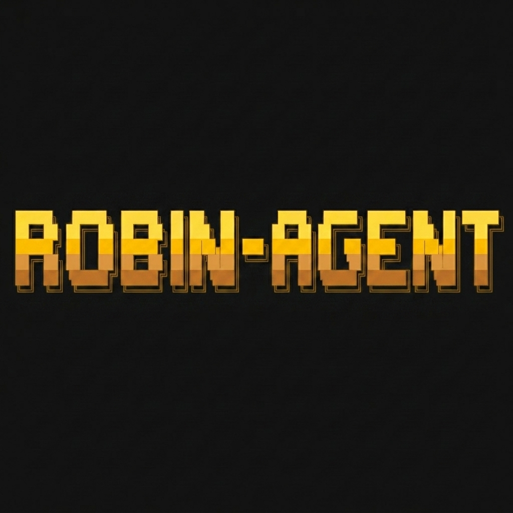

<p align="center">
  
</p>

# Robin Agent

Robin made by IfThenVoid.

Robin is a personal AI agent for terminal work, messaging, scheduled tasks,
skills, memory, and local automation. It is tuned for one operator, one machine
or server, and practical day-to-day use.

## What It Does

| Area | Summary |
| --- | --- |
| Terminal | Interactive CLI, multiline input, slash commands, streaming tool output, and command approval. |
| Messaging | Gateway support for Telegram, Discord, Slack, WhatsApp, Signal, SMS, Email, and API use. |
| Skills | Bundled skills plus optional skills that can be synced into `~/.robin/skills`. |
| Memory | Persistent sessions, searchable history, summaries, and profile-aware storage under `~/.robin`. |
| Automation | Built-in cron jobs with delivery back to the CLI or messaging gateway. |
| Providers | OpenAI-compatible APIs, OpenRouter, Anthropic, Gemini, local models, custom endpoints, and other configured providers. |

## Quick Install

For a fresh local checkout:

```bash
./setup-robin.sh
robin
```

For an install from GitHub:

```bash
curl -fsSL https://raw.githubusercontent.com/IfThenVoid/Robin/main/scripts/install.sh | bash
```

The installer supports Linux, macOS, WSL2, and Android through Termux.

## Common Commands

```bash
robin                  # Start the terminal UI
robin setup            # Configure providers and tools
robin model            # Choose or switch models
robin tools            # Configure available tools
robin gateway setup    # Configure messaging platforms
robin gateway start    # Start the messaging gateway
robin cron list        # Show scheduled jobs
robin logs             # View logs
robin doctor           # Diagnose local setup issues
```

## Development

```bash
source .venv/bin/activate  # or: source venv/bin/activate
scripts/run_tests.sh
```

The main entry points are:

| Path | Purpose |
| --- | --- |
| `run_agent.py` | Core agent loop. |
| `cli.py` | Interactive CLI orchestration. |
| `robin_cli/` | CLI subcommands and setup flows. |
| `gateway/` | Messaging gateway runtime and platform adapters. |
| `tools/` | Tool implementations and registry. |
| `skills/` | Bundled skills. |
| `optional-skills/` | Heavier or niche skills that are not active by default. |
| `website/` | Local documentation source. |

## Security

Robin is designed as a personal agent for a trusted operator. Keep API keys in
`~/.robin/.env`, review skills before installing them, and use sandboxed
terminal backends for untrusted workloads. See [SECURITY.md](SECURITY.md).

## License

MIT. See [LICENSE](LICENSE).
